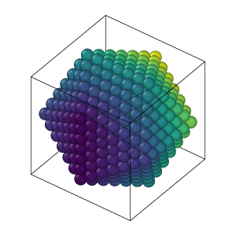
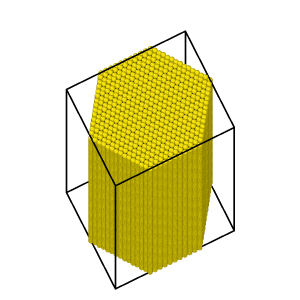

# Skeleton
This project is developed for a course named - "High Performance Computing: Molecular dynamics with C++" at University of Freiburg.
Skeleton for numerical projects with C++. This skeleton uses
[CMake](https://cmake.org/) and  automatically downloads
[Eigen3](https://eigen.tuxfamily.org/) and
[Googletest](https://github.com/google/googletest).
To accomplish this course successfully, I cordially thank [IMTEK Simulation Department](https://www.imtek.uni-freiburg.de/professuren/simulation/simulation) to guide through the process. Also we use [Ovito](https://www.ovito.org/about/) to visualize our atoms and use  [Numpy](https://numpy.org/), [Matplotlib](https://matplotlib.org/) for plots. 

[Report - High Performance Computing - Molecular dynamics with C++](https://github.com/Dwaipayan-R-C/MolecularDynamicsCpp/report/HPC_MD_Cpp_Dwaipayan.pdf) 

## Folder Structure
    .
    ├── main                                # main file to run the milestone (executable)
    │   ├── srcs                            # contains all the source files
    │   |   ├── berendseb_thermostat.cpp    
    │   |   ├── domain.cpp 
    │   |   ├── gupta.cpp 
    │   |   ├── ih.C 
    │   |   ├── lj_direct_summation.cpp 
    │   |   ├── milestones.cpp 
    │   |   ├── neighbors.cpp 
    │   |   ├── verlet.cpp 
    │   |   ├── xyz.cpp 
    │   |   └── ... 
    │   ├── data                            # contains all the data
    │   ├── header                          # contains all the header files
    │   ├── plot_code                       # contains all the plots
    │   ├── tests                           # contains all the googletests written
    │   ├── xyz                             # all xyz inputs are here created using ih.C
    │   ├── xyz_output                      # all xyz outputs from different milestones are stored here    
    │   |   └── ...                                
    │   └── ...
    └── ...     


## Experiments:
1. Berendsen Thermostat:<br/>
We use a thermostat to to remove excess energy from the system that is generated from implementing boundary condition for e.g. energy introduced by work performed on our system. We setup a molecular dynamics simulation initially as we are typically far from the equilibrium. And to achieve
this equilibrium we might heat the system. Thus, we provide the system with an additional energy by factoring the velocity and then allow it to relax for some time.

<p align="center">
  
  
</p>

2. Energy conservation for MPI and serialized:<br/>
Energy conservation is an important test to verify if our code and verlet integration is successful in propagating the simulation with time. This simulation is ran with 8 processes. 

<p align="center">
      
</p>

Also, we present potential energy and kinetic energy vs timestep with adding heat to the system every 2000 fs. 
<p align="center">
  
</p>
3. Nanowire simulation:<br/>
We present the snapshots of the isometric view of the large Nanowire with 51500 atoms and calculated at temperature = 0 K. The red color denotes the HCP lattice, brown being the FCC and yellow denotes the other atoms. 

<p align="center">
  
</p>

## Run
To run the project, navigate to the source code and create this directory,
```
mkdir build                                                         # Create a build folder
cd build                                                            # inside that folder
cmake ..                                                            # configure the cmake filer
make                                                                # build the project
./myproject                                                         # run the make file
tests/myproject_tests
```  
and to create clusters,

```
g++ ih.C -o ./build/cluster_file.out                                # create a project file
../build/cluster_file.out 6 2.885 2.74379 >../xyz/custom_923.xyz    # run the project file
```
